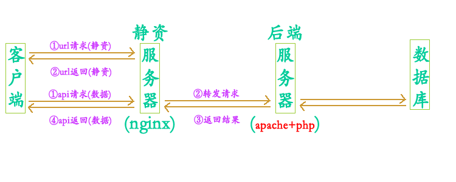
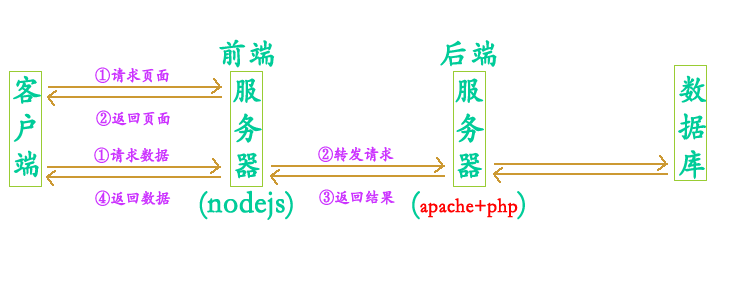
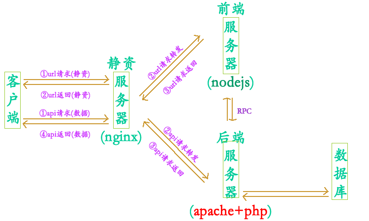

# 前端后端分离模式

> 题外话：一句话，只要超过一个人的团队，就要前后端分离；只要做SEO的产品，就要做服务端渲染。

## 适用场景

|序号|描述|
|----|:----|
|①|页面布局复杂+使用主题样式|
|②|页面渲染效果要求较高|
|③|页面包含复杂业务逻辑|
|④|页面渲染的数据量较大|

## 模式收集

### 模式①

<div align=center>

</div>

### 模式②

<div align=center>

</div>

### 模式③

<div align=center>

</div>

## 模式对比

|项目|传统模式|nginx+server|nodejs+server|nginx+nodejs+server|
|----|:----:|:----:|:----:|:----:|
|SEO|√|×|√|√|
|浏览器渲染|√|×|√|√|
|前后端耦合度|×|√|√|√|
|请求效率水平|×|√|×|√|

## 职责分工

方案1：

|项目|view|control|model|
|----|:----:|:----:|:----:|
|前端|√|√|×|
|后端|×|×|√|


>前端负责view+control；后端负责model

方案2：

|项目|view|control|model|
|----|:----:|:----:|:----:|
|前端|√|×|×|
|后端|×|√|√|


> 前端负责view；后端负责model+control

## SEO解决

```html
nodejs出现之前:
方案1：做一动一静两套页面
服务器判断请求来自蜘蛛就呈现静态页，否则呈现动态页.
方案2：
服务器架设虚拟浏览器软件，请求过来了先让虚拟浏览器跑一遍，再将得到的静态页面返回给客户端.

nodejs出现之后:
方案3：前后端同构方案
一套代码在浏览器端和node端都可以运行，从而可以先在node端请求数据渲染模板，然后将渲染结果返回给浏览器最终呈现，是目前最完美的前后端
分离+SEO解决方案
```
## 数据交互

### 交互原理
|项目|描述|
|----|:----:|
|①|接口地址|
|②|请求参数|
|③|返回参数|

### 文档谁写
> 接口文档主要由后台来设计,修改,前端开发者起到了辅助的作用。

### 数据格式
> json>xml>...

## 辨别区分

```html
1.两个项目
2.两个服务器(独立部署)
3.两个不同的工程、两个不同的代码库
4.不同的开发人员
```
简而言之：

|类目|标志|
|----|:----|
|开发时|前后端代码分离、开发职责分离、能够独立的开发测试|
|运维时|前后端应用部署分离|

> 若运维时不分离，则为半分离。

## 未来展望

|序号|描述|
|----|:----|
|①|大型分布式架构|
|②|弹性计算架构|
|③|微服务架构|
|④|多端化服务|

> 多端————浏览器端、车载终端、安卓、手机、电视...

## 参考文献


