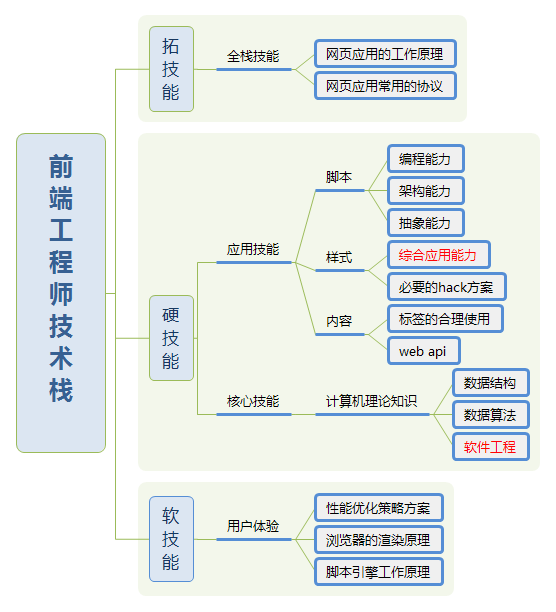

# 前端工程师的素养

> 题外话：“前端工程师到底是工作很简单的"切图仔"，还是包揽客户端和中间层的"大前端"？”

## 发展史

|时间|标志|
|:----|:----|
|1990|www|
|1995|js|
|2005|ajax|
|2008|v8→restful→spa|
|2009|nodejs|

## 技术栈

|分类|描述|
|:----|:----|
|硬技能|HTML/CSS/JavaScript|
|软技能|用户体验————web产品吸引用户的第一道菜|
|拓技能|Node.js所代表的web服务端知识|

  

## 参考文献

